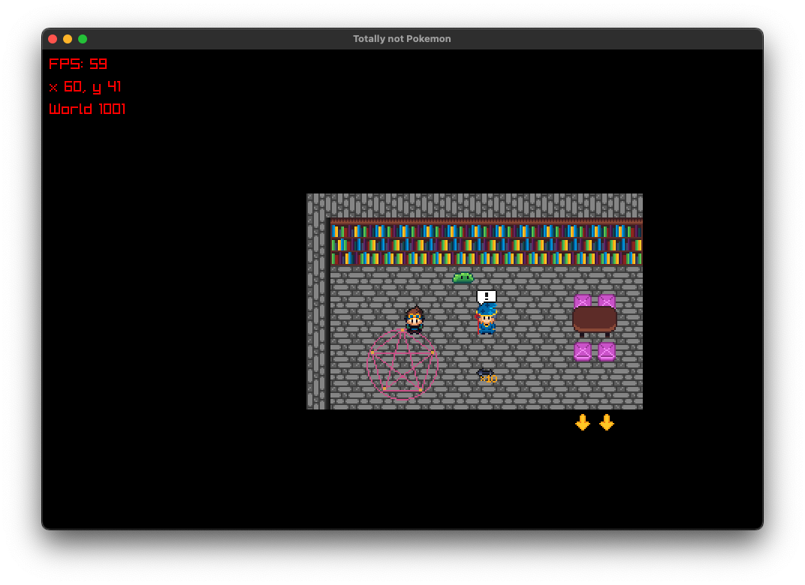
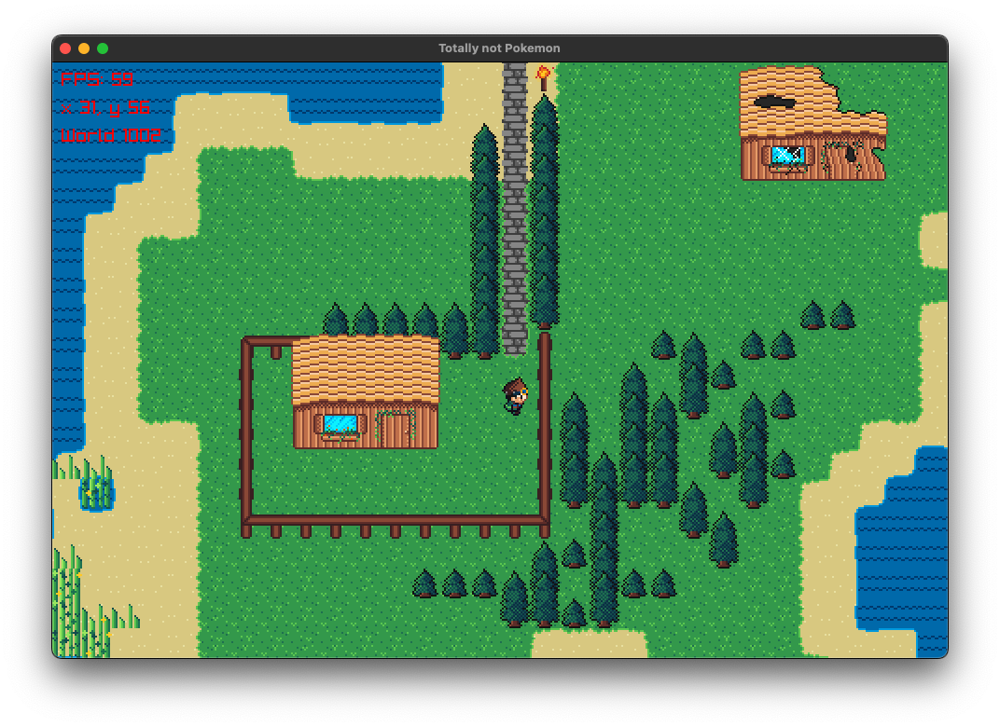
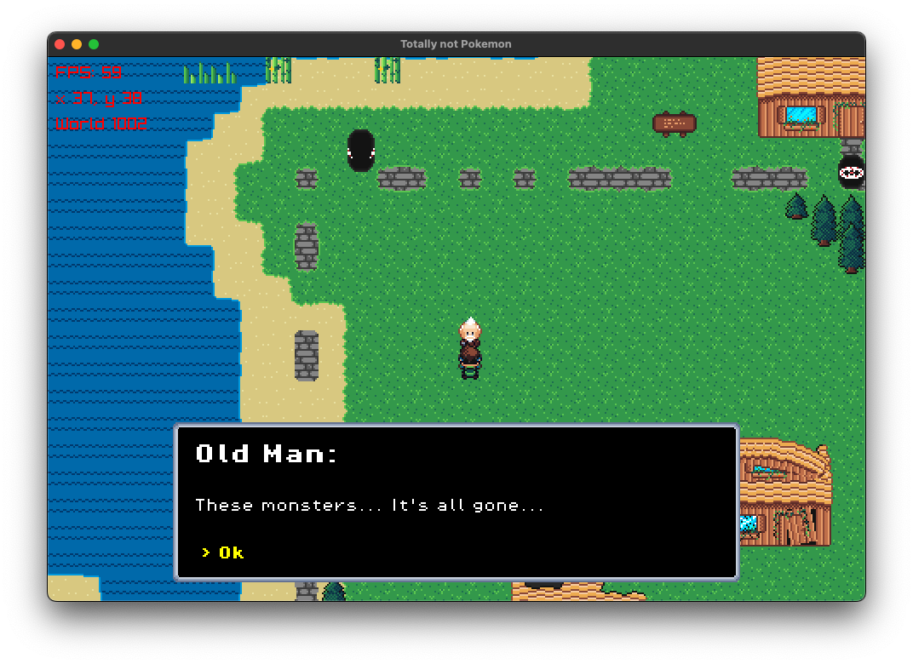
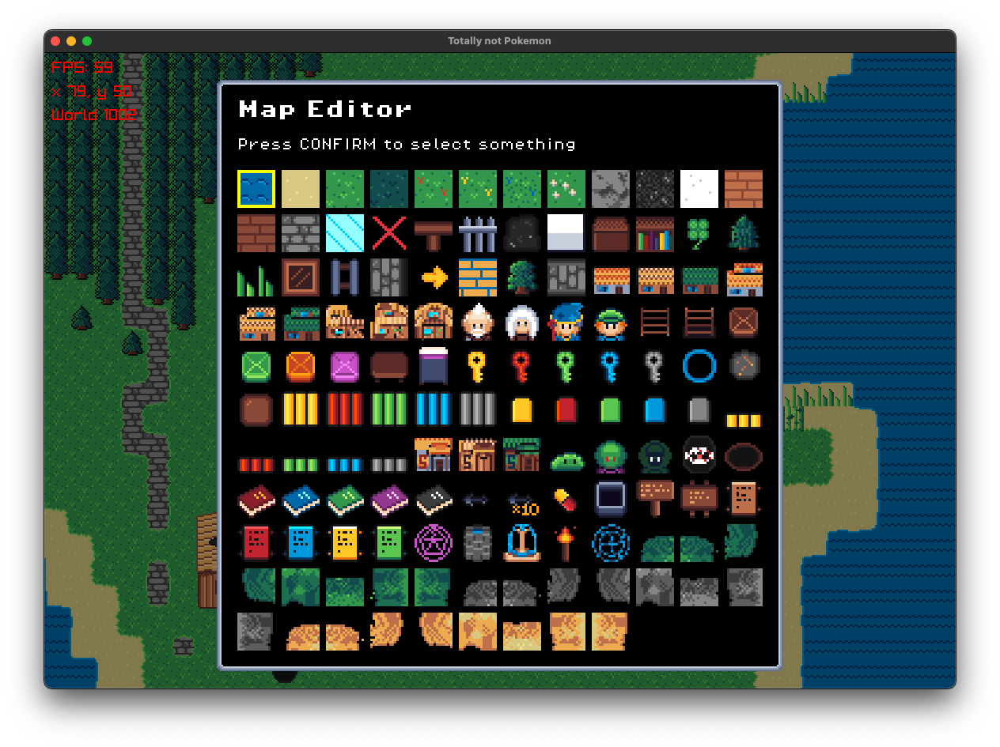

# Nokemon

So, I got bored, wanted to speriment a bit with Rust, and love GameBoy games, here's the result!

I really enjoyed the process, but have no idea what the final result should be, for now at least.

Open to contributions and ideas!

## Run
```bash
# Run the game
cargo run

# Run the game in creative mode to build levels
cargo run creative
```

### Windows
The project uses raylib, so you will need to setup and add to path cmake, libc and the usual stuff before running the steps above.

Personally (but I have no idea what I'm doing and haven't used a windows machine in 10+ years) I did the following:
1. Installed CMake from [here](https://cmake.org/download/)
2. Added CMake to path
3. Installed LLVM via `winget install LLVM.LLVM`
4. `cargo run` 

## Why lib + bind?
I'm trying to have the engine by completely independent from rendering, which is going to be useful for porting the project to iOS.

```bash
cargo lipo --package game_core --release
cbindgen --config game_core/cbindgen.toml --crate game_core --output game_core.h
```

## Screenshots





## TODO:
- lots 